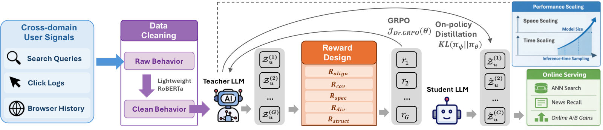
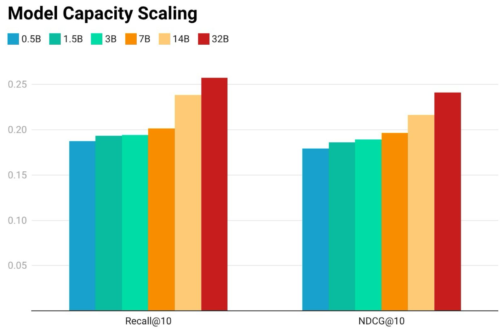
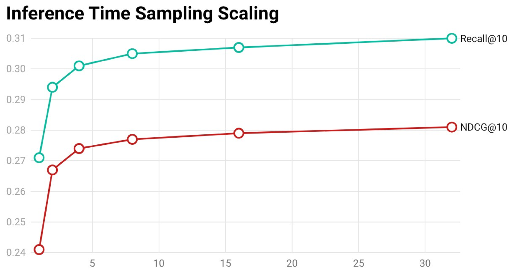

# Learning User Interests via Reasoning and Distillation for Cross-Domain News Recommendation

This repository provides the official implementation of the paper "Learning User Interests via Reasoning and Distillation for Cross-Domain News Recommendation".

## Introduction

Cross-domain news recommendation requires inferring users' underlying information needs from heterogeneous and noisy behavioral signals that often extend beyond direct news consumption. While large language models (LLMs) offer strong reasoning and semantic generalization for user understanding, directly deploying large LLMs in production remains challenging due to latency and serving cost.

We present a reinforcement learning framework that trains LLMs to generate **interest-driven news search queries from cross-domain user signals**. We formulate query-list generation as a policy optimization problem and optimize a teacher model with Dr.GRPO using multiple reward signals — retrieval alignment, interest coverage, query specificity, intra-list diversity, and structural validity. To make the framework scalable for online serving, we perform on-policy distillation to transfer the learned policy from the large teacher to a compact student model.

In a 7-day online A/B test, the deployed student model improves **DAU by 0.95%**, **CTR by 0.22%**, and **cold-user DAU by 4.38%**, while serving **67 users/sec** versus **2 users/sec** for the teacher.

## Framework

Our system operates on multiple streams of user behavioral data (web browsing events, search queries, and news click logs) and proceeds in three stages:

**1. Data Cleaning.** Raw behavioral logs are noisy, mixed with malformed or irrelevant queries. 

**2. Interest Generation with Multi-Reward RL.** Cleaned behaviors are fed to a strong teacher LLM that generates a list of interest-driven search queries. The policy is optimized using a composite reward over five complementary criteria:

- **Retrieval Alignment** (`R_align`) — each query retrieves relevant articles from the internal ANN news index (average cosine similarity to its top-K=10 retrieved articles, using Qwen3-Embedding-8B).
- **Interest Coverage** (`R_cov`) — the query set collectively reflects the user's diverse latent interests (Rubrics-as-Rewards via an LLM judge).
- **Query Specificity** (`R_spec`) — content-rich, non-generic queries (Rubrics-as-Rewards via an LLM judge).
- **Intra-list Diversity** (`R_div`) — semantic non-redundancy among queries (average pairwise cosine distance).
- **Structural Validity** (`R_struct`) — binary rule-based check of output format.

All rewards are normalized to `[0,1]` and combined with uniform weights (`λ = 1`) by default.

**3. On-Policy Distillation.** The teacher's policy is distilled into a compact student by minimizing the reverse KL divergence between the student and teacher distributions. This combines the exploration coverage of student rollouts with dense token-level teacher supervision, enabling low-latency, high-throughput serving. At serving time, the student generates a list of interest queries that retrieve candidate news articles via ANN-based retrieval, deployed as an additional recall path alongside existing components.

| Role | Model |
|---|---|
| Teacher | Qwen2.5-32B-Instruct |
| Student | Qwen2.5-0.5B-Instruct |

## Experiments

### Offline Retrieval Performance

Our RL-trained teacher (Qwen2.5-32B) achieves the best results across all metrics, and the distilled student (Qwen2.5-0.5B) preserves most of the gains while being far smaller.

| Method | Recall@5 | Recall@10 | NDCG@5 | NDCG@10 | MRR |
|---|---|---|---|---|---|
| GRU | 0.144 | 0.189 | 0.129 | 0.159 | 0.117 |
| SASRec | 0.158 | 0.206 | 0.141 | 0.173 | 0.129 |
| NRHUB | 0.162 | 0.212 | 0.145 | 0.178 | 0.133 |
| PinSage | 0.168 | 0.220 | 0.149 | 0.184 | 0.138 |
| HSTU | 0.216 | 0.250 | 0.194 | 0.228 | 0.184 |
| Qwen2.5-32B (Prompt-only) | 0.153 | 0.194 | 0.139 | 0.188 | 0.147 |
| **Ours (RL-trained, Qwen2.5-32B)** | **0.257** | **0.271** | **0.209** | **0.241** | **0.199** |
| **Ours (Distilled, Qwen2.5-0.5B)** | 0.233 | 0.261 | 0.196 | 0.235 | 0.180 |

### Online A/B Test 

Deployed as an additional recall path, the student model yields statistically significant lifts, with an especially large gain for cold users.

| Metric | Lift | p-value |
|---|---|---|
| DAU | +0.95% | 0.012 |
| CTR | +0.22% | 0.031 |
| Cold User DAU | +4.38% | 0.004 |

### Compute Scaling

**Model capacity.** Increasing model size consistently improves retrieval metrics and interest quality.

**Inference-time sampling.** Generating `N` candidate lists per user and selecting via best-of-`N` on the composite reward improves performance with diminishing returns. Production uses `N=1` due to latency constraints.

### Distillation Ablation

On-policy distillation outperforms supervised distillation and closes much of the gap to the teacher.

| Distillation Method | Recall@10 | NDCG@10 |
|---|---|---|
| Teacher (Qwen2.5-32B) | 0.271 | 0.241 |
| Supervised Distillation | 0.245 | 0.207 |
| On-policy Distillation | **0.261** | **0.235** |
| No Distillation | 0.187 | 0.179 |

### Reward Ablation

All five rewards are necessary; removing interest coverage (`R_cov`) causes the largest drop (severe reward hacking), and removing retrieval alignment (`R_align`) significantly degrades retrieval.

| Reward Setting | Recall@10 | NDCG@10 |
|---|---|---|
| Full rewards | 0.271 | 0.241 |
| w/o `R_align` | 0.162 | 0.141 |
| w/o `R_cov` | 0.115 | 0.093 |
| w/o `R_spec` | 0.196 | 0.184 |
| w/o `R_div` | 0.179 | 0.144 |
| w/o `R_struct` | 0.193 | 0.184 |

### Inference Efficiency 

The distilled student is over **30× faster** than the teacher, making it suitable for low-latency production serving.

| Model | Users/sec |
|---|---|
| Teacher (Qwen2.5-32B) | 2 |
| Student (Qwen2.5-0.5B) | 67 |
